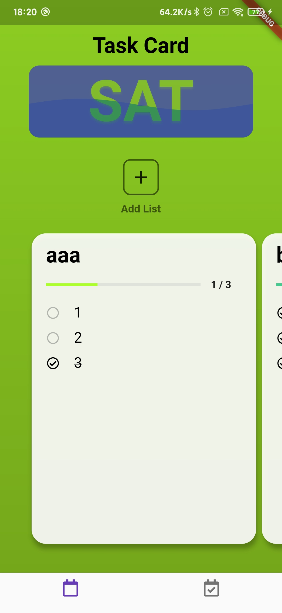
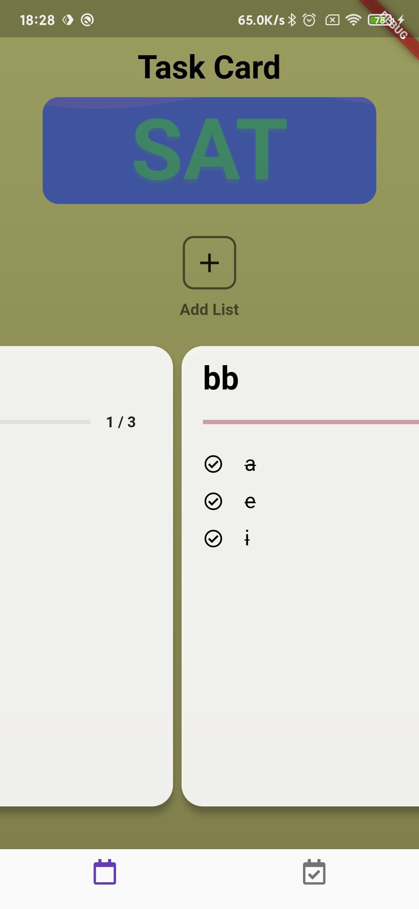
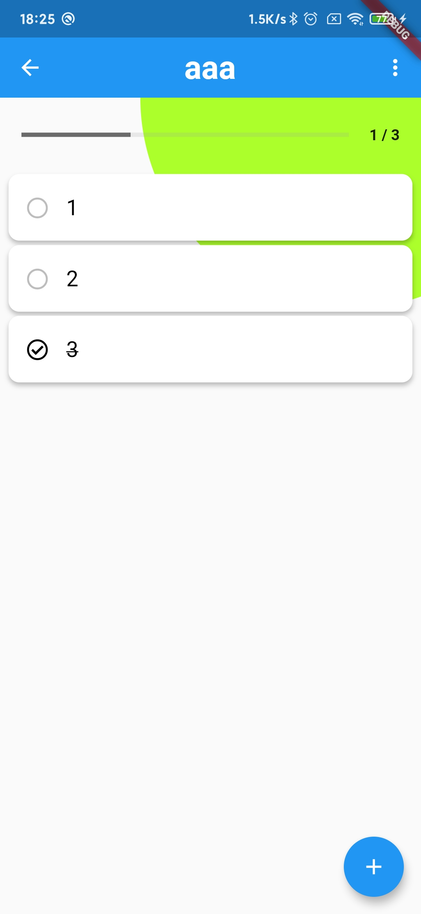
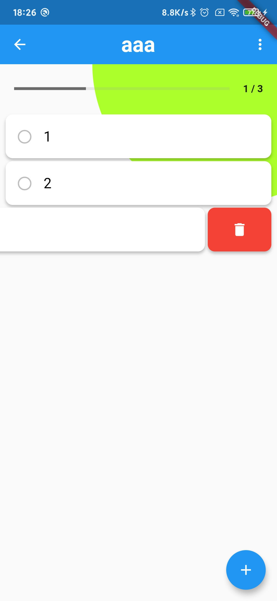
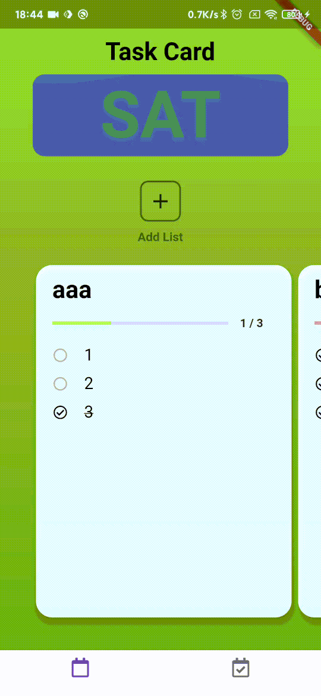

# Todo app

使用 Flutter 编写的 Todo 应用, 用以检验 Flutter 的学习成果. 

1. 使用 Provider 进行状态管理; 
2. 可以实现 UI 的局部刷新, 减少不必要的部件重建; 
3. 使用 Sqflite 完成数据持久化;
4. 滑动任务卡片时, 背景颜色有渐变效果;
5. 重新设计的侧滑按钮.


## 运行程序

运行前请使用 `flutter doctor` 命令检查 Flutter 环境.

```shell
$ git clone git@github.com:sixcubo/todo.git
$ cd todo/
$ flutter packages get
$ flutter run
```

## 程序截图

<div align="center">
	
    
</div>

<div align="center">
    
	
</div>

<div align="center">
	
</div>

## 使用的开源库

* sqflite: ^1.3.1+1
* provider: ^4.3.2+2
* font_awesome_flutter: ^8.0.1
* flutter_colorpicker: ^0.3.4
* flutter_slidable: ^0.5.7
* animated_text_kit: ^2.3.0